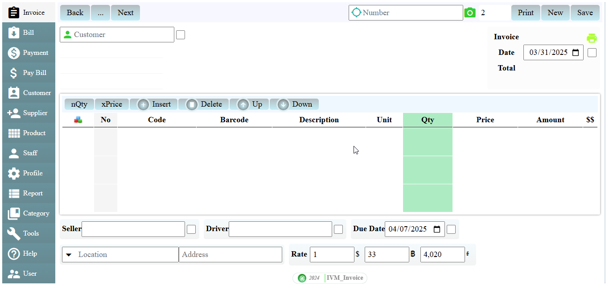
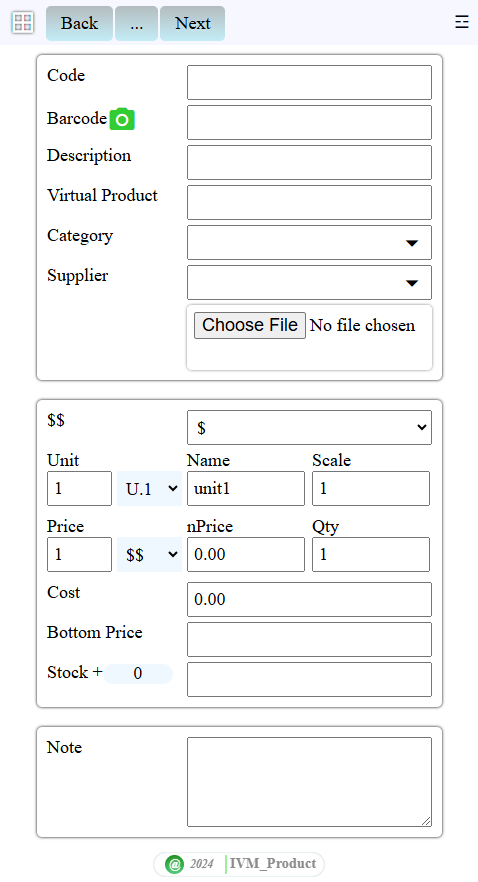

# IVM-APP
Đây là ứng dụng quản lý invoice qua giao diện web trực quan dễ sử dụng. Chương trình được vận hành bằng ngôn ngữ javascript qua NodeJS. Bạn có thể dễ dàng gửi hóa đơn hay biên lai cho khách hàng một cách nhanh chống, hay tự mình cài đặt và quản lý ứng dụng, database không cần nhờ lập trình viên can thiệp nên rất tiết kiệm tiền bạc và thời gian. Ứng dụng thích hợp cho các doanh nghiệp vừa và nhỏ, không thích hợp cho các doanh nghiệp lớn có lưu lượng hàng ngàn record mỗi ngày, vì mỗi lần lưu invoice chương trình sẽ cache một số column(thông tin cuối) để tối ưu hiệu suất quản lý. Ứng dụng trong giai đoạn được hoàn thiện còn nhiều lỗi, nếu các bạn không có sự am hiểu vi tính không nên dùng, menu bố cục có thể thay đổi trong suốt quá trình cập nhật nếu có sự đóng góp ý kiến...Để tối ưu dung lượng, bảo vệ mã nên mã sẽ chuyển thành dạng khó hiểu ở cấp độ thô sơ(nên đôi lúc bị lỗi...).

## Product

- `Code` Mã truy xuất sản phẩm, bạn nên đặt tên ngắn gọn dễ hiểu, nên thống nhất 1 ngôn ngữ
- `Barcode` Mã barcode thường 13 chữ số, nếu rỗng barcode là mã ID do hệ thống tạo ra gồm 13 chữ số (0000000000001...). Để tìm kiếm hệ thống sẽ lấy chữ số cuối của chuỗi, ví dụ: nếu bãn gõ 11 nó sẽ liệt kê tất cả sản phảm có ID hay mã barcode có chữ số cuối là 11 (0000000000011, 0000000000111, 8849301600311...)
- `Description` Diễn giải sản phẩm chi tiết hơn
- `Virtual Product` Nếu bạn không quan tâm stock hay barcode, nó sẽ giúp bạn tiết kiệm thời gian khi gõ sản phẩm, nó tạo ra nhiều sản phẩm cùng thông số
- `Unit` Có 2 trường Name và Scale hỗ trợ 4 unit, chỉ có unit thứ 1 xuất ra invoice hay bán, unit còn lại hỗ trợ chúng ta nhập số lượng theo tỉ lệ đã định
- `Price` Có 2 trường nPrice vả Qty hỗ trợ 4 nPrice, mặc định là 1, nếu ta tạo nPrice tiếp theo và quy định số lượng, khi ta bán ra đến số lượng đã định thì nó tự động lấy price theo số lượng tương ứng
- `Bottom Price` Bạn nên tạo giá trị cho nó, vì mỗi lần bạn sửa giá trị Price trong invoice nếu giá trị <= giá trị đã định thì hệ thống sẽ hiển thị hili màu đỏ

