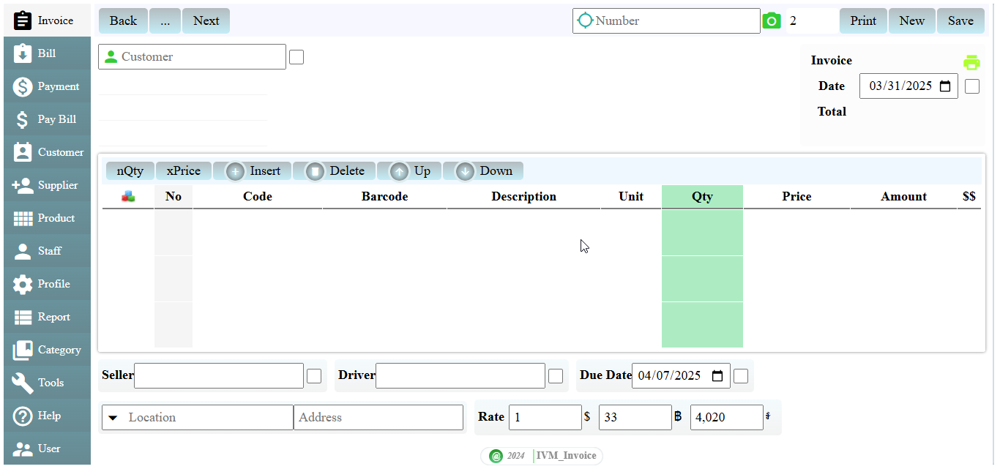

# IVM-APP
Đây là ứng dụng quản lý invoice qua giao diện web trực quan dễ sử dụng. Chương trình được vận hành bằng ngôn ngữ javascript qua NodeJS. Bạn có thể dễ dàng gửi hóa đơn hay biên lai cho khách hàng một cách nhanh chống, hay tự mình cài đặt và quản lý ứng dụng, database không cần nhờ lập trình viên can thiệp nên rất tiết kiệm tiền bạc và thời gian. Ứng dụng thích hợp cho các doanh nghiệp vừa và nhỏ, không thích hợp cho các doanh nghiệp lớn có lưu lượng hàng ngàn record mỗi ngày, vì mỗi lần lưu invoice chương trình sẽ cache một số column(thông tin cuối) để tối ưu hiệu suất quản lý. Ứng dụng trong giai đoạn được hoàn thiện còn nhiều lỗi, nếu các bạn không có sự am hiểu vi tính không nên dùng, menu bố cục có thể thay đổi trong suốt quá trình cập nhật nếu có sự đóng góp ý kiến...Để tối ưu dung lượng, bảo vệ mã nên mã sẽ chuyển thành dạng khó hiểu ở cấp độ thô sơ(nên đôi lúc bị lỗi...).

